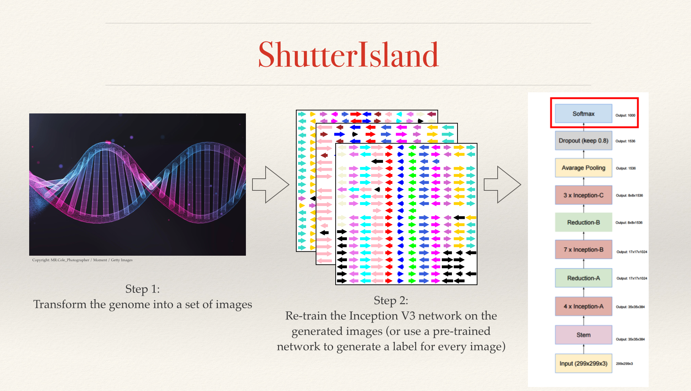

# ShutterIsland

* The folder **images/** contains the training dataset used in our method. It includes two subfolders whose names define the labels. More details on this are mentioned below. 
* The folder **ecoli_images/** contains sample testing data, namely the images generated for each gene in the **Escherichia coli APEC O1** genome.
* The folder **inception-retrain/** contains the scripts needed to train the network (i.e. *retrain.py*) and generate new predictions (i.e. *label_image.py*).
* **34_genomes.pdf** lists all the genome names used as the testing dataset. 
* **manualpegtopfg.tab** is used to map each gene to its corresponding family. This is used to infer functionality and determine the color of the arrow representing the gene in the generated images. 

The rest of the files are referenced and explained below. 

<h1> Image Generation </h1> 

The following steps were performed to generate the images:

1. Call the Compare Region Viewer service provided by PATRIC. The following command includes the parameters we used in our study:
    *curl --max-time 300 --data-binary '{\"method\": \"SEED.compare\_regions\_for\_peg\", \"params\": [\"$peg\", 10000, 20, \"pgfam\", \"representative+reference\"], \"id\": 1}'         https://p3.theseed.org/services/compare\_region"*
    Where $peg is the query gene of interest. Repeat this call for all genes/pegs of interest and place all the output jsons in one folder (let's call it **input\_jsons**). 
1. Run the program **JsonToCoordinates.py** with **input\_jsons** as input to parse the JSON files into a different format to be used by the image generating software. The resulting file will be **xyc.txt**, which is the input to **CoordsToJpg.java**. 
1. Compile and run the Java program **CoordsToJpg.java** which will convert the coordinate file into images. 
1. Split the images into the appropriate classes (an example can be found in the tutorial linked to below). 

<h1> Transfer Learning </h1> 

Shutter Island works in 3 steps: 

1. Transform the genome into a set of images, using the steps outlined in the Image Generation section above. *Note that images generated have dimensions=299x299, which is what is expected at the input layer of the network.*
1. Re-train the Inception V3 network on the generated images. From TensorFlow's documentation: This step trains a new top layer (replacing the top layer highlighted in a red box in the image below) that can recognize other classes of images. The top layer receives as input a 2048-dimensional vector for each image. We train a softmax layer on top of this representation.
The model is then saved to perform future predictions. In the Testing phase, a re-trained model is used to generate a label for every test image. 
1. Group genes with a genomic island label and report the cluster as a single Genomic Island, applying a length filter of 8 kbp (i.e. the group of genes must span at least 8,000 base pairs). 

We list the steps needed to re-train the Incpetion V3 network on the generated images:

1. Organize the data in a folder containing a subfolder for each class. The subfolder names matter because they will define the label applied to each image within them. In our example, a folder named **images/** contains two subfolders: **islands/** and **continents/**, which are the names of the two classes our network will be trained on (we refer to a genomic region that is not part of a genomic island as a continent). The name of the parent folder will be used as an argument in the next step. 
1. From inception-retrain/, run *python retrain.py --bottleneck_dir=../images/bottlenecks --how_many_training_steps 500 --model_dir=../images/model --output_graph=../images/retrained_graph.pb --output_labels=../images/retrained_labels.txt --image_dir=../images*
This step re-trains the model on our custom image dataset, and saves it for future use. 
1. After the model has been trained, run python *label_image.py <test_images>*, where <test_images> is a folder containing the images we would like to perform the predictions on. We provide **ecoli_images** that contains images generated for every gene in the **Escherichia coli APEC O1** genome. This script outputs two files, **islands.txt** and **continents.txt**, enumerating the images that correspond to each class. 
1. The last step is to run *cluster.py <genome_file>* which takes as input a genome file name (i.e. in this case: 405955.13.PATRIC.cds.tab that can be downloaded from https://patricbrc.org) and uses **islands.txt** generated earlier to group the genes labeled as part of a genomic island. The script will output *<genome_name>.islands* which contains the final island predictions. 

These steps were extracted and modified from a Tensoerflow tutorial on transfer learning, originally found at:

https://www.tensorflow.org/hub/tutorials/image_retraining

